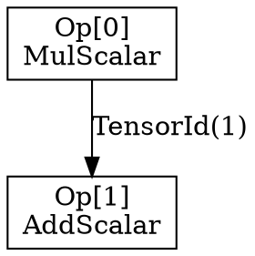

# Burn Fusion Graph Debugging

This guide explains how to use Burn's new fusion graph debugging capabilities to visualize and analyze compute graphs.

## Overview

Burn's fusion system optimizes tensor operations by combining them into efficient execution plans. The debugging API allows you to:

- **Access pre-optimized operation queues** - See the raw operations as written by the user
- **Visualize operation dependencies** - Understand how tensors flow between operations  
- **Generate ASCII and DOT graphs** - Create visual representations of compute graphs
- **Monitor fusion optimization** - Track how operations get combined into execution plans

## Quick Start

```rust
use burn::backend::Wgpu;
use burn::tensor::Tensor;
use burn_fusion::{debug, Fusion};
use burn_common::id::StreamId;

type Backend = Wgpu; // Any fusion-enabled backend

fn main() {
    let device = Default::default();
    
    // Create operations that will be queued for fusion
    let tensor1 = Tensor::<Backend, 2>::from_data([[1.0, 2.0], [3.0, 4.0]], &device);
    let tensor2 = tensor1 * 2.0;
    let tensor3 = tensor2 + 1.0;
    let tensor4 = tensor3.tanh();
    
    // Access the current stream's operations BEFORE execution
    let current_stream = StreamId::current();
    if let Some(operations) = Backend::debug_pre_optimized(&device, current_stream) {
        // Generate ASCII visualization
        let ascii_graph = debug::operations_to_ascii_graph(&operations);
        println!("{}", ascii_graph);
        
        // Generate DOT format for GraphViz
        let dot_graph = debug::operations_to_dot_graph(&operations);
        println!("{}", dot_graph);
    }
    
    // Force execution (operations will be consumed)
    let result = tensor4.to_data();
    
    // Get fusion summary
    let summary = Backend::debug_fusion_summary(&device);
    println!("Fusion Summary: {:#?}", summary);
}
```

## API Reference

### Core Debugging Methods

#### `Backend::debug_pre_optimized(device, stream_id) -> Option<Vec<OperationIr>>`
Returns the raw operation sequence for a specific stream before optimization.

#### `Backend::debug_all_pre_optimized(device) -> HashMap<StreamId, Vec<OperationIr>>`
Returns all operation sequences across all streams.

#### `Backend::debug_fusion_summary(device) -> FusionDebugSummary`
Returns a summary of the current fusion state including stream count, operation count, and execution plan statistics.

### Visualization Functions

#### `debug::operations_to_ascii_graph(operations) -> String`
Generates a human-readable ASCII representation of the operation graph showing:
- Operation details with inputs/outputs
- Tensor dependencies and flow
- Operation numbering and relationships

#### `debug::operations_to_dot_graph(operations) -> String`
Generates GraphViz DOT format for creating visual diagrams with tools like:
- GraphViz (`dot`, `neato`, `fdp`)
- Online viewers (GraphvizOnline, etc.)
- IDE plugins

#### `debug::operations_to_dependencies(operations) -> HashMap<usize, Vec<usize>>`
Returns operation dependency mapping for custom analysis.

### Convenience Methods

#### `Backend::debug_pre_optimized_ascii_graph(device, stream_id) -> Option<String>`
Combines operation access and ASCII generation in one call.

#### `Backend::debug_all_pre_optimized_ascii_graph(device) -> String`
Generates ASCII graphs for all streams.

#### `Backend::debug_pre_optimized_dot_graph(device, stream_id) -> Option<String>`
Combines operation access and DOT generation in one call.

## Understanding the Output

### ASCII Graph Format
```
Pre-optimized Operation Graph:
============================

Op[0]: NumericFloat(F32, MulScalar(...))
  Inputs:  TensorId(0)(external) 
  Outputs: TensorId(1) 

Op[1]: NumericFloat(F32, AddScalar(...))
  Inputs:  TensorId(1)(from Op[0]) 
  Outputs: TensorId(2) 

Dependency Flow:
================
Op[1] depends on: [0]
```

- **Op[N]**: Operation index and type details
- **Inputs**: Source tensors (external or from previous operations)
- **Outputs**: Result tensor IDs
- **Dependency Flow**: Which operations depend on others

### DOT Graph Format


This can be visualized using GraphViz tools or online viewers.

### Fusion Summary
```rust
FusionDebugSummary {
    stream_count: 1,           // Number of active streams
    total_operations: 3,       // Total operations across all streams
    execution_plan_count: 1,   // Number of optimized execution plans
    execution_plan_summaries: [...], // Details about each plan
}
```

## Best Practices

### 1. Capture Before Execution
Operations are consumed during execution, so access them before calling `.to_data()` or similar methods:

```rust
// ✅ Good: Access before execution
let operations = Backend::debug_pre_optimized(&device, stream_id);
let result = tensor.to_data(); // Operations consumed here

// ❌ Bad: Access after execution  
let result = tensor.to_data();
let operations = Backend::debug_pre_optimized(&device, stream_id); // Returns None
```

### 2. Use Current Stream
Most operations happen on the current stream:

```rust
let current_stream = StreamId::current();
let operations = Backend::debug_pre_optimized(&device, current_stream);
```

### 3. Handle Empty Results
Operations may be empty if they've been executed or if no operations were queued:

```rust
if let Some(ops) = Backend::debug_pre_optimized(&device, stream_id) {
    if !ops.is_empty() {
        let graph = debug::operations_to_ascii_graph(&ops);
        println!("{}", graph);
    } else {
        println!("No operations in queue");
    }
} else {
    println!("Stream not found or already executed");
}
```

## Advanced Usage

### Custom Analysis
```rust
let operations = Backend::debug_pre_optimized(&device, stream_id)?;
let dependencies = debug::operations_to_dependencies(&operations);

// Find operations with no dependencies (entry points)
let entry_ops: Vec<_> = dependencies.iter()
    .filter(|(_, deps)| deps.is_empty())
    .map(|(op_id, _)| *op_id)
    .collect();

// Find operations with multiple dependencies (merge points)
let merge_ops: Vec<_> = dependencies.iter()
    .filter(|(_, deps)| deps.len() > 1)
    .map(|(op_id, _)| *op_id)
    .collect();
```

### Export for External Tools
```rust
// Save DOT file for GraphViz
let dot_content = debug::operations_to_dot_graph(&operations);
std::fs::write("graph.dot", dot_content)?;

// Convert to SVG with GraphViz
// $ dot -Tsvg graph.dot -o graph.svg
```

## Troubleshooting

### "No operations found"
- Operations may have been executed already
- Try accessing before calling `.to_data()` or similar methods
- Check if you're using the correct stream ID

### "Stream not found"
- The stream may not have any operations
- Use `debug_all_pre_optimized()` to see all active streams
- Ensure operations were actually created

### Empty graphs
- Operations might be very simple and get optimized away immediately
- Try more complex operation sequences
- Check the fusion summary for execution plan details

## Examples

See `examples/burn-test/examples/graph-debug.rs` for a complete working example demonstrating all debugging capabilities.
